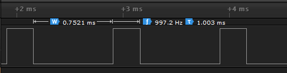
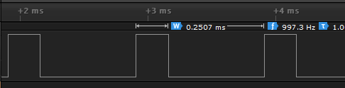

## Meşgul bekleme

```C
#include "stm32f4xx.h"

int main(){

	RCC->AHB1ENR |= RCC_AHB1ENR_GPIODEN;
	GPIOD->MODER |= GPIO_MODER_MODER14_0;
	
	SysTick->CTRL |= SysTick_CTRL_CLKSOURCE_Msk;
	SysTick->LOAD = (int)(0.6 * 16000000);
	SysTick->CTRL |= SysTick_CTRL_ENABLE_Msk;
	
	while(1){
		GPIOD->ODR |= GPIO_ODR_OD14;
		while(!(SysTick->CTRL & SysTick_CTRL_COUNTFLAG_Msk));
		GPIOD->ODR &= ~GPIO_ODR_OD14;
		while(!(SysTick->CTRL & SysTick_CTRL_COUNTFLAG_Msk));
	}

}
```
---
## Yoklama yöntemi
```C
#include "stm32f4xx.h" 

int main(){

	RCC->AHB1ENR |= RCC_AHB1ENR_GPIODEN;
	GPIOD->MODER |= GPIO_MODER_MODER14_0;
	
	SysTick->CTRL |= SysTick_CTRL_CLKSOURCE_Msk;
	SysTick->LOAD = (int)(0.6 * 16000000);
	SysTick->CTRL |= SysTick_CTRL_ENABLE_Msk;
	
	while(1){
		
		if(SysTick->CTRL & SysTick_CTRL_COUNTFLAG_Msk){
			if(GPIOD->ODR & GPIO_ODR_OD14)
				GPIOD->ODR &= ~GPIO_ODR_OD14;
			else
				GPIOD->ODR |= GPIO_ODR_OD14;
		}
			
	}
}
```
---
## Kesme
```C
#include "stm32f4xx.h" 

void SysTick_Handler(void);
void SysTick_Handler(void){
	if(GPIOD->ODR & GPIO_ODR_OD14)
				GPIOD->ODR &= ~GPIO_ODR_OD14;
			else
				GPIOD->ODR |= GPIO_ODR_OD14;
}

int main(){

	RCC->AHB1ENR |= RCC_AHB1ENR_GPIODEN;
	GPIOD->MODER |= GPIO_MODER_MODER14_0;
	
	SysTick->CTRL |= SysTick_CTRL_CLKSOURCE_Msk;
	SysTick->LOAD = (int)(0.1 * 16000000);
	SysTick->CTRL |= SysTick_CTRL_TICKINT_Msk;
	SysTick->CTRL |= SysTick_CTRL_ENABLE_Msk;
	
	while(1);
}
```
---
## PWM sinyali f:1kHz, %25 duty cycle

```C
#include "stm32f4xx.h"

static volatile unsigned int high=4000;
static volatile unsigned int low=12000;

void SysTick_Handler(void);
void SysTick_Handler(void){
	if(GPIOD->ODR & GPIO_ODR_OD14){
		GPIOD->ODR &= ~GPIO_ODR_OD14;
		SysTick->LOAD = high;
	}
	else{
		GPIOD->ODR |= GPIO_ODR_OD14;
		SysTick->LOAD = low;
	}	
}
int main(){

	RCC->AHB1ENR |= RCC_AHB1ENR_GPIODEN;
	GPIOD->MODER |= GPIO_MODER_MODER14_0;
	
	SysTick->CTRL |= SysTick_CTRL_CLKSOURCE_Msk;
	SysTick->LOAD = low;
	SysTick->CTRL |= SysTick_CTRL_TICKINT_Msk;
	SysTick->CTRL |= SysTick_CTRL_ENABLE_Msk;
	
	while(1);
}
```
Programın çalışması sonucu lojik analizöründe görülen sinyal:


