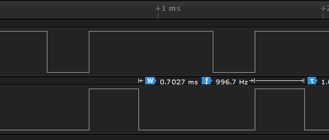

```C
#include "stm32f4xx.h"

int main(){
	RCC->AHB1ENR |= RCC_AHB1ENR_GPIOBEN | RCC_AHB1ENR_GPIOCEN;
	RCC->APB1ENR |= RCC_APB1ENR_TIM3EN;
	
	GPIOB->MODER |= GPIO_MODER_MODER5_1;
	GPIOC->MODER |= GPIO_MODER_MODER8_1;
	
	GPIOB->AFR[0] |= GPIO_AFRL_AFSEL5_1;
	GPIOC->AFR[1] |= GPIO_AFRH_AFSEL8_1;
	
	TIM3->PSC = 15; 
	TIM3->ARR = 1000;
	
	TIM3->CCR2 = 750;
	TIM3->CCR3 = 300;
	
	TIM3->CCMR1 |= TIM_CCMR1_OC2M_2 | TIM_CCMR1_OC2M_1;
	TIM3->CCMR2 |= TIM_CCMR2_OC3M_2 | TIM_CCMR2_OC3M_1;
	
	TIM3->CCER |= TIM_CCER_CC2E | TIM_CCER_CC3E;
	
	TIM3->CR1 |= TIM_CR1_CEN;

    while(1);
}
```
Programın çalışması sonucu lojik analizöründe görülen sinyaller:





